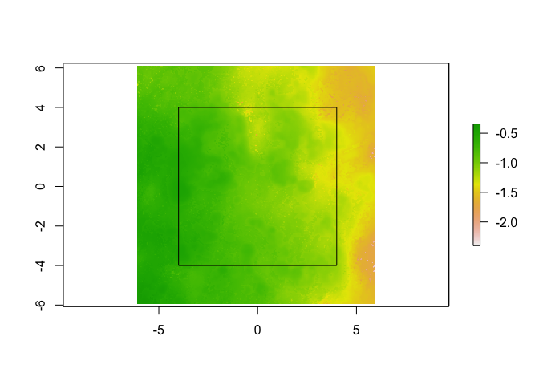

``` r
library(habtools)
library(raster)
library(tidyverse)
library(Rvcg)
library(sf)
library(parallel)
cl <- makeCluster(detectCores())
```

# Drone DEM

``` r
# Load data
dem0 <- raster("data/Underwater_DEM/site_4-04_time_08_DEM_1.22mm.tif")
dem1 <- raster("data/Drone_DEM/Reef_42_2021_08_18_SFM_4_04_DEM.tif")
grd <- st_read("data/Grid/grid_4-04.shp", quiet=TRUE)
plot(dem1)

# Find mid point from shapefile grid
lat_mid <- st_bbox(grd)[2] + diff(c(st_bbox(grd)[2], st_bbox(grd)[4]))/2
lon_mid <- st_bbox(grd)[1] + diff(c(st_bbox(grd)[1], st_bbox(grd)[3]))/2
points(lon_mid, lat_mid)
```


``` r

# Re-project DEM for meters?
sr <- paste0("+proj=tmerc +lat_0=", lat_mid, " +lon_0=", lon_mid, " +k=1 +x_0=0 +y_0=0 +datum=WGS84 +units=m +no_defs")
dem0_reproj <- projectRaster(dem0, crs=sr) # Will take ~1 minute
dem1_reproj <- projectRaster(dem1, crs=sr)

# Crop to 8 x 8 m
dem0_crp <- dem_crop(dem0_reproj, x0=0, y0=0, L=8, plot=TRUE)
```


``` r
dem1_crp <- dem_crop(dem1_reproj, x0=0, y0=0, L=8, plot=TRUE)
```



``` r

# Checking resolution of layers
res(dem0_crp)
#> [1] 0.00122 0.00122
res(dem1_crp)
#> [1] 0.027 0.027

# Change res of SfM to that of drone, for fair comparison. 
r <- terra::project(terra::rast(dem0_crp), terra::rast(dem1_crp))
dem0_crp_coarse <- raster::raster(r)

res(dem0_crp_coarse)
#> [1] 0.027 0.027

# crop into 16 boxes
xy <- expand.grid(x0=c(-3, -1, 1, 3), y0=c(-3, -1, 1, 3))

dem0_grd_coarse <- dem_crop(dem0_crp_coarse, x0=xy$x0, y0=xy$y0, L=2, plot=TRUE)
```


``` r
dem0_grd <- dem_crop(dem0_crp, x0=xy$x0, y0=xy$y0, L=2, plot=TRUE)
```


``` r
dem1_grd <- dem_crop(dem1_crp, x0=xy$x0, y0=xy$y0, L=2, plot=TRUE)
```


``` r

fd(dem1_grd[[1]], method = "hvar", lvec = habtools::extent(dem1_grd[[1]]) / c(1, 2, 4, 8, 16), diagnose = TRUE)
```


    #> $D
    #> [1] 2.13437
    #> 
    #> $data
    #>          l          h
    #> 1 0.124875 0.03325045
    #> 2 0.249750 0.07136232
    #> 3 0.499500 0.13043902
    #> 4 0.999000 0.21886827
    #> 5 1.998000 0.38136774
    #> 
    #> $lvec
    #> [1] 0.124875 0.249750 0.499500 0.999000 1.998000
    #> 
    #> $D_vec
    #> [1] 1.898211 2.129859 2.253313 2.198880
    #> 
    #> $var
    #> [1] 0.1562922
    #> 
    #> $method
    #> [1] "hvar"


    # Calculate fractal dimesion
    data <- data.frame(box=1:16)
    data$D_sfm <- parSapply(cl, dem0_grd, function(x) { habtools::fd(x, method="hvar", lvec = habtools::extent(x) / c(1, 2, 4, 8, 16)) }) # 3D fractal dimension
    data$D_sfm_coarse <- parSapply(cl, dem0_grd_coarse, function(x) { habtools::fd(x, method="hvar", lvec = habtools::extent(x) / c(1, 2, 4, 8, 16)) }) # 3D fractal dimension
    data$D_drone <- parSapply(cl, dem1_grd, function(x) { habtools::fd(x, method="hvar", lvec = habtools::extent(x) / c(1, 2, 4, 8, 16)) }) # 3D fractal dimension

    # HEight
    data$H_sfm <- parSapply(cl, dem0_grd, hr) # 3D fractal dimension
    data$H_sfm_coarse <- parSapply(cl, dem0_grd_coarse, hr) # 3D fractal dimension
    data$H_drone <- parSapply(cl, dem1_grd, hr) # 3D fractal dimension

    # rugosity
    data$R_sfm <- parSapply(cl, dem0_grd, rg, method = "hvar", L0 = 2/16) # 3D fractal dimension
    data$R_sfm_coarse <- parSapply(cl, dem0_grd_coarse, rg, method = "hvar", L0 = 2/16) # 3D fractal dimension
    data$R_drone <- parSapply(cl, dem1_grd, rg, method = "hvar", L0 = 2/16) # 3D fractal dimension

``` r
# plots findings
data %>% pivot_longer(cols=D_sfm:D_sfm_coarse, names_to = "Resolution", values_to = "D_sfm") %>%
  ggplot() +
  geom_point(aes(x=D_sfm, y=D_drone, col=Resolution)) +
  xlim(1.9, 2.5) +
  ylim(1.9, 2.4) +
  geom_abline(intercept = 0, slope = 1) +
  theme_classic()
#> Warning: Removed 1 rows containing missing values (`geom_point()`).
```


``` r

data %>% pivot_longer(cols=H_sfm:H_sfm_coarse, names_to = "Resolution", values_to = "H_sfm") %>%
  ggplot() +
  xlim(0, 1.3) +
  ylim(0, 1.3) +
  geom_point(aes(x=H_sfm, y=H_drone, col=Resolution)) +
  geom_abline(intercept = 0, slope = 1) +
  theme_classic()
```


``` r

data %>% pivot_longer(cols=R_sfm:R_sfm_coarse, names_to = "Resolution", values_to = "R_sfm") %>%
  ggplot() +
  geom_point(aes(x=R_sfm, y=R_drone, col=Resolution)) +
  xlim(1, 1.5) +
  ylim(1, 1.5) +
  geom_abline(intercept = 0, slope = 1) +
  theme_classic()
```


``` r

# histogram of differences
hist(data$D_sfm - data$D_sfm_coarse)
```


